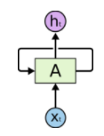

RAT: Review
----
Individual Name: ___________________  
Team Names: _____________ &nbsp;&nbsp;&nbsp; _____________ &nbsp;&nbsp;&nbsp; _____________ &nbsp;&nbsp; _____________ &nbsp;&nbsp;&nbsp; _____________

1) Label each of images on the main screen with Reinforcement Learning terms:

1.  
2.  
3.  
4.  

2) Select the NN architecture this diagram represents: 

- MLP
- CNN
- RNN
- LSTM  
- GAN
- MLB
- CIA

3) LSTM is an acronym for:    
They are a special kind of _______ network, capable of learning ________ dependencies.

4) Give 1 example of each (not covered in class): 

5) Your spikey-haired boss wants to use General Adversarial Network (GAN) for text data. Draw a diagram of GAN. Is that going to work? Why or why not?